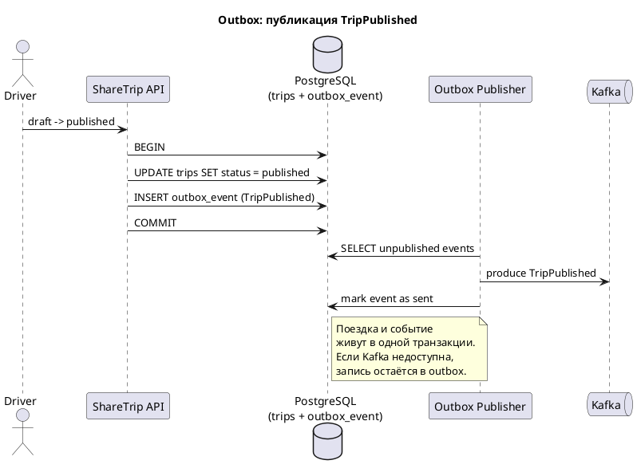
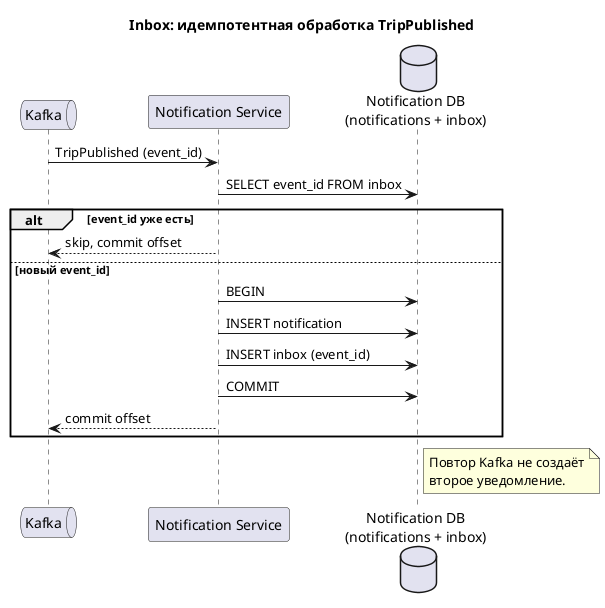
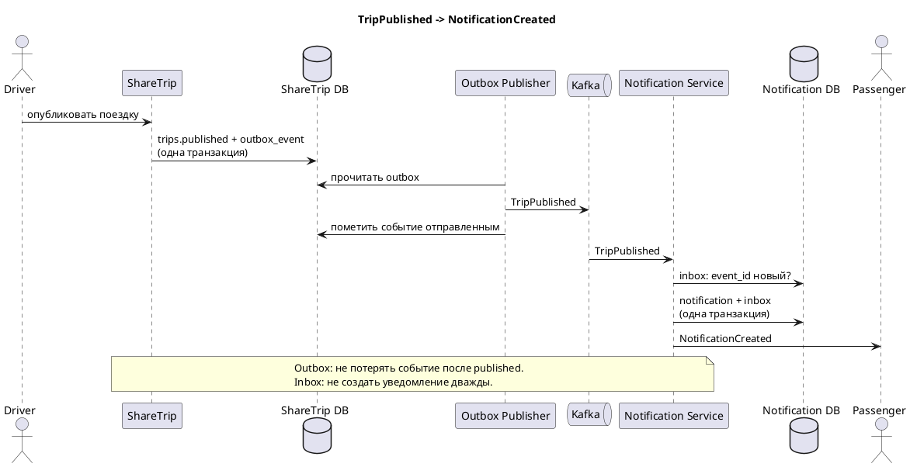

# ShareTrip

ShareTrip — учебный проект по моделированию домена сервиса совместных поездок. Проект описывает ключевые сущности, бизнес-процессы, состояния, правила и доменные события системы без привязки к конкретной технологии реализации.

## Назначение проекта

Система ShareTrip предназначена для организации совместных поездок между водителями и пассажирами.
Она помогает:

- создавать поездки;
- публиковать их для поиска;
- принимать заявки пассажиров;
- бронировать места в машине;
- подтверждать участие сторон;
- отменять бронирования и поездки;
- завершать поездки.

## Структрура проекта

```bash
.
├── cmd
│   └── sharetrip
│       └── main.go
├── config
│   ├── app.go
│   └── env.go
├── coverage.out
├── deploy
│   ├── alloy
│   │   └── config.alloy
│   ├── docker-compose.yml
│   ├── logs
│   ├── loki
│   │   └── config.yaml
│   ├── otel-collector
│   │   └── config.yaml
│   └── prometheus
│       └── prometheus.yml
├── docs
├── go.mod
├── go.sum
├── internal
│   ├── api
│   │   ├── api_test
│   │   │   ├── create_trip_test.go
│   │   │   ├── fixtures_test.go
│   │   │   ├── move_trip_draft_to_publish_integration_test.go
│   │   │   ├── move_trip_from_publish_to_started_integration_test.go
│   │   │   └── server_test.go
│   │   ├── create_trip.go
│   │   ├── errors
│   │   │   └── trip_errors.go
│   │   ├── get_trip.go
│   │   ├── move_trip_draft_to_publish.go
│   │   ├── move_trip_from_publish_to_started.go
│   │   ├── ready.go
│   │   ├── response.go
│   │   ├── route.go
│   │   ├── server.go
│   │   └── trip_handler.go
│   ├── app
│   │   └── logger.go
│   ├── business
│   │   ├── slot
│   │   │   ├── api
│   │   │   ├── entity
│   │   │   ├── repository
│   │   │   └── service
│   │   ├── trip
│   │   │   ├── domain
│   │   │   │   ├── create_trip.go
│   │   │   │   ├── domain.go
│   │   │   │   ├── get_trip.go
│   │   │   │   ├── move_trip_draft_to_publish.go
│   │   │   │   └── move_trip_from_publish_to_started.go
│   │   │   ├── entity
│   │   │   │   └── trip.go
│   │   │   ├── repository
│   │   │   │   ├── create_trip.go
│   │   │   │   ├── get_trip.go
│   │   │   │   ├── repository.go
│   │   │   │   ├── trip_history.go
│   │   │   │   └── update_trip.go
│   │   │   └── service
│   │   │       ├── create_trip.go
│   │   │       ├── get_trip.go
│   │   │       ├── move_trip_draft_to_publish.go
│   │   │       ├── move_trip_from_publish_to_started.go
│   │   │       └── service.go
│   │   └── tripissue
│   │       ├── api
│   │       ├── entity
│   │       ├── repository
│   │       └── service
│   ├── clock
│   ├── id
│   ├── middleware
│   │   ├── http_metrics_middleware.go
│   │   ├── keycloak.go
│   │   └── logger_middleware.go
│   ├── observability
│   │   ├── logctx
│   │   │   └── logger_context.go
│   │   ├── metrics
│   │   │   └── metrics.go
│   │   └── tracing
│   │       └── tracing.go
│   ├── shared
│   │   └── outbox
│   │       ├── event.go
│   │       └── event_repository.go
│   ├── storage
│   │   ├── db.go
│   │   └── transaction.go
│   ├── test_utils
│   │   └── token.go
│   └── validators
│       └── uuid.go
├── logs
│   └── app.log
├── Makefile
├── migrations
│   ├── 20260620075550_001_create_trip_tables.sql
│   └── 20260627072720_create_outbox_event_table.sql
├── README.md
├── reports
│   └── coverage.out
├── rule.md
└── skill.md
```

## Основные домены

### Trip
Поездка — центральная доменная модель системы.

**Trip отвечает за:**
- кто создал поездку;
- когда она должна состояться;
- маршрут: откуда и куда;
- текущий статус поездки;
- связь с местами и заявками.

**Участвует в процессах:**
- создание поездки;
- поиск поездки;
- бронирование места;
- отмена бронирования;
- завершение поездки.

### TripIssue
TripIssue — заявка пассажира на участие в поездке или связанное с поездкой обращение.

**TripIssue отвечает за:**
- кто подал заявку;
- к какой поездке она относится;
- статус заявки;
- фиксацию жизненного цикла заявки.

**Участвует в процессах:**
- подача заявки;
- подтверждение участия;
- отмена;
- обработка спорных ситуаций.

### Slot
Slot — отдельное место в машине, связанное с конкретной поездкой.

**Slot отвечает за:**
- принадлежность к поездке;
- текущее состояние места;
- доступность для бронирования.

**Возможные статусы Slot:**
- `AVAILABLE` — место доступно;
- `BOOKED` — место занято;
- `CANCELLED` — место снято с бронирования или недоступно.

## Жизненный цикл поездки

Для домена `Trip` используются следующие состояния:

- `Draft` — поездка создана, но ещё не опубликована;
- `Published` — поездка доступна для заявок;
- `Matched` — есть принятая заявка;
- `Confirmed` — стороны подтвердили участие;
- `InProgress` — поездка началась;
- `Finished` — поездка завершена;
- `Cancelled` — поездка отменена.

### Переходы между состояниями

```text
[*] -> Draft
Draft -> Published
Draft -> Cancelled
Published -> Matched
Published -> Cancelled
Matched -> Confirmed
Matched -> Cancelled
Confirmed -> InProgress
Confirmed -> Cancelled
InProgress -> Finished
InProgress -> Cancelled
Finished -> [*]
Cancelled -> [*]
```

### Роли, выполняющие переходы

| Переход | Роль |
|---|---|
| Draft -> Published | Водитель / создатель поездки |
| Draft -> Cancelled | Водитель / создатель поездки |
| Published -> Matched | Водитель при принятии заявки |
| Published -> Cancelled | Водитель / создатель поездки |
| Matched -> Confirmed | Водитель и пассажир |
| Matched -> Cancelled | Водитель, пассажир, система |
| Confirmed -> InProgress | Водитель или система |
| Confirmed -> Cancelled | Водитель, пассажир, система |
| InProgress -> Finished | Водитель или система |
| InProgress -> Cancelled | Водитель или система |

## Основные процессы

### 1. Создание поездки
**Инициатор:** водитель.

**Участвующие домены:** `Trip`.

**Результат:** создаётся новая поездка в статусе `Draft`, затем может быть опубликована.

### 2. Поиск поездки
**Инициатор:** пассажир.

**Участвующие домены:** `Trip`, `Slot`.

**Результат:** пассажир получает список доступных поездок и свободных мест.

### 3. Бронирование места
**Инициатор:** пассажир.

**Участвующие домены:** `Trip`, `TripIssue`, `Slot`.

**Результат:** создаётся заявка, свободное место переводится в занятое состояние.

### 4. Отмена бронирования
**Инициатор:** пассажир, водитель или система.

**Участвующие домены:** `TripIssue`, `Slot`, `Trip`.

**Результат:** заявка отменяется, место освобождается или переводится в отменённое состояние.

### 5. Завершение поездки
**Инициатор:** водитель или система.

**Участвующие домены:** `Trip`, `Slot`.

**Результат:** поездка переходит в статус `Finished`.

## Бизнес-правила

Ниже приведены базовые бизнес-правила проекта:

1. **Лимит активных заявок**  
   Пассажир может иметь ограниченное количество активных заявок одновременно.

2. **Срок жизни заявки**  
   Заявка существует ограниченное время и может быть автоматически отменена системой.

3. **Двустороннее подтверждение**  
   Для перехода поездки в статус `Confirmed` требуется подтверждение от обеих сторон.

4. **Правила отмены**  
   Для отмены поездки или бронирования действуют дедлайны и последствия для сторон.

5. **Ограничение вместимости**  
   Система не допускает бронирование мест сверх доступного количества.

## Доменные события

Примеры ключевых доменных событий:

| Событие | Кто создаёт | Условие | Влияет на агрегат |
|---|---|---|---|
| `TripCreated` | Водитель | Создана новая поездка | `Trip` |
| `TripPublished` | Водитель | Поездка опубликована | `Trip` |
| `TripIssueSubmitted` | Пассажир | Подана заявка | `TripIssue`, `Trip` |
| `SlotBooked` | Пассажир / система | Забронировано место | `Slot`, `Trip` |
| `TripCancelled` | Водитель / пассажир / система | Поездка отменена | `Trip`, `Slot`, `TripIssue` |

## Исключительные ситуации

### 1. Овербукинг
Если два пассажира одновременно претендуют на одно и то же место, система должна зафиксировать только одно успешное бронирование, а второе отклонить или перевести в конфликтную обработку.

### 2. Отмена поездки после подтверждения
Если водитель отменяет поездку после подтверждения участия, система должна отменить связанные бронирования, уведомить пассажиров и применить последствия согласно правилам платформы.

### 3. Отсутствие подтверждения до дедлайна
Если пассажир или водитель не подтверждает участие вовремя, система автоматически завершает ожидание и переводит заявку или поездку в соответствующее состояние.

## Границы системы

### Система учитывает
- поездки;
- заявки пассажиров;
- места в машине;
- статусы поездок и заявок;
- подтверждения сторон;
- отмены и завершение поездок.

### Система не отвечает за
- физическое перемещение автомобиля;
- навигацию и маршрутизацию в реальном времени;
- проверку личности пользователей вне правил платформы;
- внешние платёжные процессы, если они не включены в требования.

## Цель моделирования

README фиксирует предметную область ShareTrip на концептуальном уровне. Это основа для дальнейшего проектирования:

- доменной модели;
- агрегатов и инвариантов;
- бизнес-правил;
- use case-сценариев;
- API и структуры хранения данных.

## Надёжная доставка события TripPublished

После публикации поездки ShareTrip отправляет событие `TripPublished` в Kafka. Notification Service читает его и создаёт уведомление.

Наивная схема:

```text
ShareTrip -> Kafka -> Notification Service
```

Ниже — как устроить надёжную доставку без общей транзакции между сервисами.

### 1. Описание проблемы двойной записи

В монолите публикацию поездки и создание уведомления можно сделать в одной транзакции PostgreSQL:

```sql
BEGIN;
UPDATE trips SET status = 'published';
INSERT INTO notifications (...);
COMMIT;
```

Если любой шаг падает, откатывается всё.

В микросервисах так нельзя:

- у ShareTrip своя база данных;
- у Notification Service своя база данных;
- Kafka — отдельная инфраструктура;
- Contract Service — отдельный сервис.

Локальная транзакция PostgreSQL не покрывает эти системы сразу.

**Двойная запись** — сервис пишет в два места: в свою БД и во внешнюю систему (Kafka, другой сервис, чужую БД). Если первая запись успешна, а вторая нет, система остаётся в промежуточном состоянии.

### 2. Пример, как можно потерять событие после публикации поездки

Наивный порядок в ShareTrip:

1. Сохранить поездку в статусе `published`.
2. Отправить `TripPublished` в Kafka.

Сценарий потери:

1. Водитель публикует поездку (`draft -> published`).
2. ShareTrip успешно коммитит статус в своей БД.
3. Kafka временно недоступна, либо процесс падает до отправки сообщения.
4. Поездка в ShareTrip уже опубликована.
5. Notification Service не получает `TripPublished` и не создаёт уведомление.

Событие потеряно. Повтор HTTP-запроса публикации это не чинит: поездка уже `published`, повтор может вернуть 204 и больше не писать в Kafka.

### 3. Почему retry недостаточен для пишущих операций

Retry помогает при временных технических ошибках:

- сеть дернулась;
- сервис вернул 503;
- Kafka недоступна;
- consumer перезапускается.

Retry не отвечает на вопрос: что делать, если часть бизнес-процесса уже выполнена?

Примеры:

- поездка уже `published`, а событие не ушло — повтор публикации не обязан снова писать в Kafka;
- оплата уже зарезервирована, а уведомление не создалось — повтор оплаты может зарезервировать деньги второй раз.

Если шаг выполнен, а процесс нужно остановить, нужен не retry, а **компенсация**: новое бизнес-действие (`refund`, `cancel trip`), а не повтор исходной команды.

### 4. Разделение на читающую и пишущую нагрузку

**Читающая нагрузка** — сервис запрашивает информацию и не меняет чужое состояние.

Пример: ShareTrip спрашивает Contract Service, можно ли компании пользоваться услугой `trip_publish`. Ответ `allowed=true/false`. Если запрос не прошёл, его можно повторить: повтор не создаёт новый бизнес-эффект.

**Пишущая нагрузка** — сервис просит другой сервис изменить состояние.

Примеры:

- ShareTrip → Payment Service: зарезервировать оплату;
- ShareTrip → Notification Service: создать уведомление;
- ShareTrip → Kafka: опубликовать `TripPublished`.

Слепой retry здесь опасен: можно списать деньги дважды, создать два уведомления или получить разные состояния в разных сервисах. Для пишущих сценариев нужны идемпотентность, outbox, inbox, saga и компенсации.

### 5. Где нужен outbox

Outbox нужен на стороне **producer** — в ShareTrip, в момент публикации поездки.

Изменение агрегата `Trip` и запись события выполняются в одной локальной транзакции PostgreSQL:

1. `UPDATE trips SET status = 'published'`.
2. `INSERT INTO outbox_event` с `TripPublished` (`event_id`, `trip_id`, payload).
3. `COMMIT`.

Отдельный publisher читает таблицу outbox, отправляет сообщение в Kafka и помечает событие как отправленное. Если Kafka недоступна, событие остаётся в outbox и уйдёт позже.

Чтение Contract Service (`allowed?`) в outbox не кладётся: это читающий вызов.



### 6. Где нужен inbox

Inbox нужен на стороне **consumer** — в Notification Service.

Одно и то же `TripPublished` может прийти несколько раз:

- consumer обработал сообщение и упал до commit offset;
- Kafka отдала сообщение повторно;
- publisher отправил событие ещё раз из outbox;
- произошёл rebalance consumer group.

Как работает inbox:

1. Получить событие.
2. Проверить `event_id` в таблице обработанных событий.
3. Если `event_id` уже есть — пропустить.
4. Если новый — в одной транзакции создать уведомление и сохранить `event_id`.
5. После успешного commit — commit offset.

Inbox не обещает, что событие придёт один раз. Он обещает, что бизнес-действие применится один раз: одно уведомление на один `event_id`.



### 7. Какие действия могут быть компенсациями в ShareTrip

Компенсация — бизнес-действие, которое нейтрализует уже выполненный шаг. Это не технический rollback чужой базы.

| Уже выполненный шаг | Если процесс нельзя продолжить | Компенсация |
|---|---|---|
| Поездка переведена в `published` | Договор стал недействителен, оплата не прошла | Отмена публикации: `published -> cancelled` и событие `TripCancelled` / `TripPublicationCancelled` |
| Событие `TripPublished` уже ушло | Поездку отменили после публикации | Новое событие отмены. Старое уведомление нельзя «разотправить» |
| Notification Service создал уведомление | Поездку отменили | Новое уведомление об отмене |
| Payment Service зарезервировал оплату | Публикация отменена | `refund` / снятие резерва |
| Пассажир подал заявку на опубликованную поездку | Поездку отменили | Отмена заявок и освобождение слотов |

Outbox и inbox надёжно доставляют и обрабатывают события. Saga описывает порядок шагов и эти компенсации. Saga может использовать outbox/inbox, но не заменяет их.

Общий процесс `TripPublished -> NotificationCreated`:



## Статус проекта

Проект находится на стадии доменного анализа и формализации правил. Техническая реализация не входит в рамки текущего этапа.
