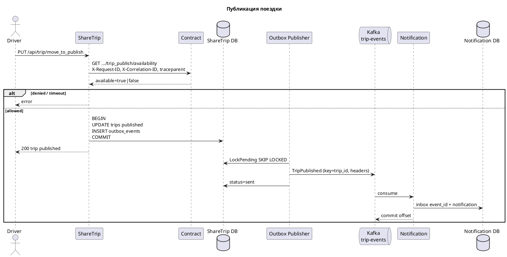
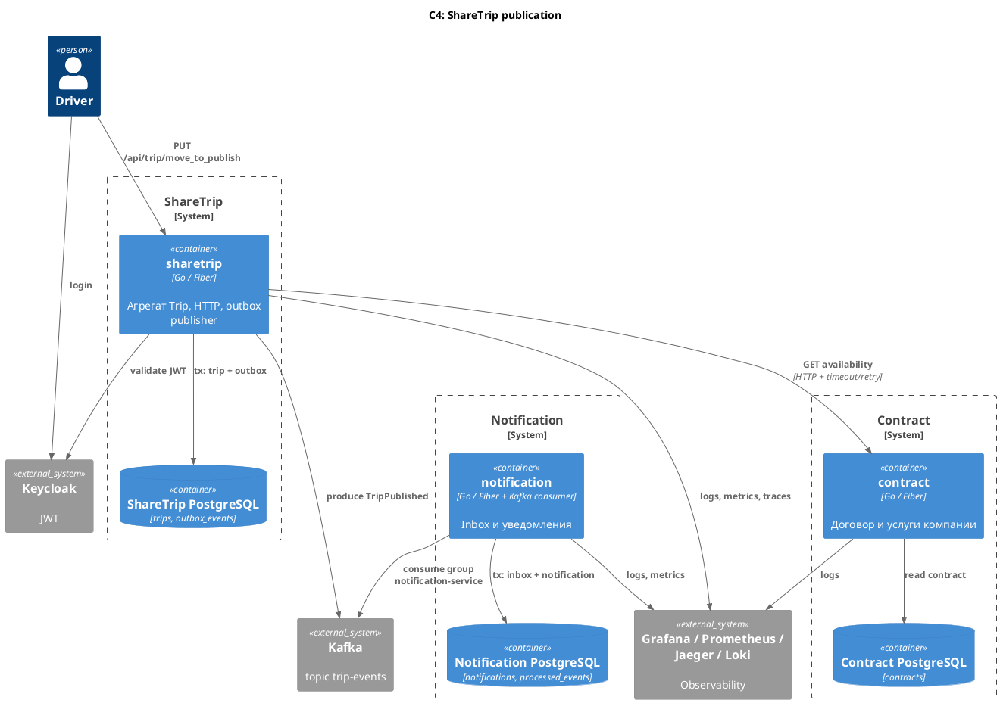

# Microservices architecture review: ShareTrip

Документ фиксирует фактическую архитектуру процесса публикации поездки: границы сервисов, контракты, консистентность, runtime и наблюдаемость. Микросервисы здесь не «модный стек», а ответ на разные типы нагрузки: проверка прав должна быть синхронной и блокирующей, доставка уведомления — нет.

## Process overview

Пользователь публикует черновик поездки. Команда идёт в ShareTrip, проверка прав — в Contract, уведомление — в Notification через Kafka.

1. Клиент вызывает `PUT /api/trip/move_to_publish` с `tripId` и `companyId` (JWT Keycloak, роль `client`).
2. ShareTrip читает или создаёт `X-Request-ID`, `X-Correlation-ID`, `traceparent`.
3. ShareTrip синхронно вызывает Contract: `GET /api/companies/{companyId}/services/trip_publish/availability`.
4. Если услуга недоступна или Contract недоступен — HTTP-команда завершается ошибкой, поездка не меняется.
5. Если проверка прошла, в одной транзакции PostgreSQL:
   - `trips.status` становится `published`;
   - пишется история статусов;
   - в `outbox_events` кладётся `trip_published` (payload + `metadata`).
6. In-process outbox publisher (`FOR UPDATE SKIP LOCKED`) отправляет событие в Kafka topic `trip-events`, ключ сообщения — `trip_id`.
7. Notification consumer group `notification-service` читает сообщение, берёт metadata из Kafka headers.
8. В одной транзакции notification:
   - `INSERT INTO processed_events (event_id) ON CONFLICT DO NOTHING` (inbox);
   - при новой строке создаёт уведомление `trip_published`.
9. Offset Kafka коммитится только после успешной обработки.

Поездка публикуется независимо от того, жив ли notification. Уведомление догоняет событие позже.



## Services

### sharetrip

Владеет агрегатом **Trip**: создание, `draft → published`, `published → started`, чтение поездки.

Не владеет договором и не доставляет уведомления. Перед сменой статуса спрашивает Contract. События жизненного цикла (`trip_published`, `trip_started`) пишет в свой outbox и публикует в Kafka.

База: своя PostgreSQL (`trips`, `outbox_events`). В таблицы contract/notification не ходит.

### contract

Владеет **договором компании** и флагами услуг (`trip_publish`, `trip_start` и др.).

Отвечает на вопрос «можно ли этой компании эту услугу сейчас». Синхронный HTTP API. Своя PostgreSQL. Kafka не читает.

### notification

Владеет **доставкой уведомлений**: inbox (`processed_events`) и таблица `notifications`.

Читает `trip-events`, идемпотентно создаёт уведомление по `event_id`. Не меняет поездку и не проверяет договор.

Kafka — транспорт, не владелец данных. Outbox защищает продюсера, inbox — консьюмера.

## Contracts

### HTTP: sharetrip → contract

```
GET {CONTRACT_SERVICE_URL}/api/companies/{companyId}/services/{service}/availability
```

Для публикации `service=trip_publish`.

Заголовки: `X-Request-ID`, `X-Correlation-ID`, `traceparent`, `X-Trip-ID`, `X-User-ID`.

Ответ: `{ "available": true|false, "reason": "..." }`.

Клиент Resty: timeout (`REQUEST_TIMEOUT_MS`, в коде секунды из конфига), retry (`RETRY_ATTEMPTS`, по умолчанию 2) на сеть и 429/502/503/504. Ошибка или `available=false` → публикация не выполняется.

### Событие TripPublished

Topic: `trip-events`. Kafka key: `trip_id` (партиция и порядок по поездке).

Payload:

```json
{
  "event_id": "uuid",
  "event_type": "trip_published",
  "trip_id": "uuid",
  "driver_id": "uuid",
  "company_id": "uuid",
  "correlation_id": "req-...",
  "causation_id": "req-...",
  "traceparent": "00-...-...-01",
  "occurred_at": "2026-04-03T10:15:00Z"
}
```

Headers: `event_id`, `event_type`, `correlation_id`, `causation_id`, `traceparent`.

`event_id` = `outbox_events.id`. `causation_id` для этого события — `request_id` HTTP-команды. Тот же формат используется для `trip_started`.

Inbox смотрит на `event_id`, не на Kafka key.

## Consistency

### Outbox (ShareTrip)

`UPDATE trips` и `INSERT outbox_events` в одной транзакции. Publisher раз в секунду берёт `pending` через `FOR UPDATE SKIP LOCKED`, шлёт в Kafka, ставит `sent`. При ошибке — `attempts`, до 10 раз `pending`, затем `failed`.

Повтор publisher безопасен: одно и то же `event_id`. Inbox отсечёт дубль.

### Inbox (Notification)

`INSERT processed_events (event_id) ON CONFLICT DO NOTHING` и создание notification в одной транзакции. Если строки нет — дубль, уведомление не создаётся, offset можно коммитить.

### Что можно повторять

| Операция | Retry? |
|---|---|
| GET availability | да, чтение |
| HTTP publish при 5xx/timeout до COMMIT | да, поездка ещё draft |
| повтор HTTP после COMMIT | идемпотентно: уже `published` → 204, новое событие не пишется |
| outbox → Kafka | да |
| Kafka → consumer | да, inbox по `event_id` |

Компенсация (`published → cancelled`) — отдельный бизнес-сценарий, не автоматический rollback Kafka.

## Runtime

Фактически в репозиториях есть Deployment + ConfigMap + Secret example. **Service и probes в манифестах пока не заведены.** HTTP `/api/ready` есть у приложений. Outbox publisher живёт **в процессе ShareTrip**, отдельного worker Deployment нет.

| Сервис | Deployment | HTTP | Worker |
|---|---|---|---|
| sharetrip | `k8s/sharetrip-deployment.yaml`, replicas=2 | да, порт 8080 | goroutine publisher |
| contract | `k8s/contract-deployment.yaml`, replicas=2 | да | нет |
| notification | `k8s/notification-deployment.yaml`, replicas=2 | да (`/api/ready`, `/api/metrics`) | Kafka consumer в том же процессе |

Для HTTP-сервисов нужен Kubernetes Service (`contract-service` уже прописан в `CONTRACT_SERVICE_URL`). Для in-process worker отдельный Service не нужен.

Рекомендуемые probes (ещё не в YAML): liveness/readiness на `/api/ready`. Readiness notification должен учитывать, что HTTP может быть готов раньше, чем consumer догнал topic.

### ConfigMap и Secret

Каждый сервис — свой ConfigMap и Secret, `envFrom` в Deployment.

| | ConfigMap | Secret |
|---|---|---|
| sharetrip | `HTTP_PORT`, `CONTRACT_SERVICE_URL`, `KAFKA_BROKERS`, `TRIP_EVENTS_TOPIC`, timeout/retry, Keycloak issuer | `DATABASE_DSN`, JWT/Keycloak secret |
| contract | `HTTP_PORT`, `REQUEST_TIMEOUT_MS` | `DATABASE_DSN` |
| notification | brokers, topic, `KAFKA_GROUP_ID=notification-service` | `DATABASE_DSN`, `SMS_PROVIDER_TOKEN` |

В Git только `*.secret.example.yaml`. Смена ConfigMap/Secret требует пересоздания Pod.

## Observability

| ID | Где | Зачем |
|---|---|---|
| `request_id` | `X-Request-ID` | один HTTP-запрос |
| `correlation_id` | `X-Correlation-ID`, payload, Kafka header | весь процесс публикации |
| `trace_id` / `traceparent` | HTTP и Kafka headers | trace в Jaeger |
| `event_id` | outbox PK, payload, headers, inbox | одно событие |
| `causation_id` | metadata | что породило событие |

### Метрики процесса

ShareTrip: `sharetrip_trip_publish_total/duration{result}`, `sharetrip_contract_request_total/duration{result}`, `sharetrip_outbox_pending_total`, `sharetrip_outbox_publish_total{result}`, `sharetrip_outbox_publish_failed_total`.

Notification: `notification_consume_total/duration{result}`, `notification_inbox_duplicate_total`, `notification_send_total{result}`.

Labels только низкой кардинальности (`result`). `trip_id` / `user_id` / `event_id` — в логах и trace, не в Prometheus labels.

Dashboard **Trip publication**: `deploy/grafana/dashboards/trip-publication.json` (rate/error publish, p95 HTTP и contract, outbox backlog, inbox duplicates, consume/send, consumer lag). Расследование: README ShareTrip, раздел «Как расследовать: уведомление не пришло».

## Failure scenarios

### Contract недоступен

Timeout и ограниченный retry. Поездка не публикуется. Клиент получает ошибку «publish not allowed» / недоступность. Логи с `request_id`. Растёт `sharetrip_contract_request_total{result="error"}`.

### Kafka недоступна

`COMMIT` поездки уже прошёл. Событие в outbox `pending`. Растут `sharetrip_outbox_pending_total` и `sharetrip_outbox_publish_failed_total`. После восстановления Kafka publisher досылает.

### Notification упал

Сообщения в topic. Растёт consumer lag. После рестарта consumer дочитывает. Inbox не даст второе уведомление, если обработка прошла, а commit offset — нет.

### Повтор события

`ON CONFLICT DO NOTHING` → метрика `notification_inbox_duplicate_total`, лог `InboxInsert result=duplicate`.

### Уведомление не пришло

См. проверочный вопрос ниже. Потеря `correlation_id` на любом hop — дефект наблюдаемости, не «нормальная недоступность».

## Trade-offs

**Лучше:** у Trip, договора и уведомлений разные циклы изменений; Contract переиспользуется (publish и start); падение notification не откатывает публикацию; сервисы масштабируются отдельно.

**Сложнее:** сеть, timeout, retry, eventual consistency, две БД, outbox/inbox, отдельный конфиг, распределённый debug.

**Почему оправдано:** проверка прав обязана быть до `published` — это синхронная граница. Уведомление не часть инварианта поездки — это асинхронная граница. Без outbox/inbox эта граница теряла бы события или слала дубли. Kubernetes поднимает процессы, но не заменяет эти гарантии.

Микросервисы здесь меняют тип сложности: вместо большого модуля — явные контракты и отказные сценарии. Это плата за независимую доставку уведомлений и переиспользуемые права, а не за количество репозиториев.

## Диаграммы

### C4 container



### Sequence

См. диаграмму в разделе Process overview.

## Проверочный вопрос

**Если завтра уведомления перестанут приходить, какие данные помогут найти причину за 10 минут?**

1. **Логи ShareTrip** по `correlation_id` / `request_id` / `trip_id`: команда дошла, Contract ответил `allowed`, был ли `OutboxInsert`.
2. **Метрики contract:** `sharetrip_contract_request_total{result}` — если error/denied, события нет, искать права или недоступность Contract.
3. **Outbox:** строка с `event_id`, `status` (`pending` / `sent` / `failed`), `sharetrip_outbox_pending_total`, `sharetrip_outbox_publish_failed_total`. `pending`/`failed` → Kafka или publisher.
4. **Trace** по `traceparent`/`trace_id`: HTTP publish и вызов Contract в одной трассе; consume — связанный span из Kafka headers.
5. **Kafka consumer lag** group `notification-service`, topic `trip-events`: lag растёт — notification не успевает или лежит.
6. **Логи notification** по **`event_id`**: `ConsumeTripPublished`, `InboxInsert`, `SendNotification`.
7. **Inbox** `processed_events`: нет строки — событие не обработано; есть, а уведомления нет — ошибка после inbox (сейчас пишутся в одной tx, значит искать send/метрику `notification_send_total{result="error"}`); `notification_inbox_duplicate_total` — повтор, не потеря.

Без `event_id` не связать outbox, Kafka и inbox. Без `correlation_id` не собрать HTTP → Contract → outbox в один сценарий. Метрики outbox и lag отвечают «где очередь», логи и inbox — «что случилось с конкретным событием».
